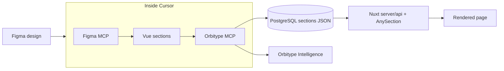

# Orbitype Headless CMS

## Purpose

Guide developers and Cursor agents through the section-driven Orbitype CMS: design in Figma, implement in this Nuxt repo, persist content JSON in PostgreSQL via Orbitype MCP.

Official API and MCP authentication: [Orbitype Docs - API Authentication](https://www.orbitype.com/docs/oQSPNY)

## When to Apply

- Adding or changing `components/sections/*.vue`
- Editing `pages` / `posts` content or `sections` JSON in the database
- Configuring `.cursor/mcp.json` for Orbitype SQL or S3
- Building marketing pages from Figma designs
- Debugging welcome/fallback when the SQL API is not configured

## When Not to Apply

- Pure layout/shell changes with no CMS sections (`Navigation`, `Footer`)
- Local mock-only work (`ORBITYPE_MOCK=true`) when DB writes are out of scope

## Recommended developer workflow



1. **Design** — Lay out pages and sections in Figma.
2. **Inside Cursor** — **Figma MCP** for specs; build `components/sections/Section*.vue`; **Orbitype MCP** (`orbitype_get_context`, `sql_crud_execute`) to write `sections` JSON.
3. **Orbitype Intelligence** — Content operations in the Orbitype app (section editing, page review, CMS management).

Do not hand-edit production JSON without a read-first backup of the current `sections` array.

## Request flow

1. User opens a URL (`/`, `/platform`, `/docs/...`).
2. Nuxt `pages/*` handles the route.
3. Page calls `server/api/*` (for example `/api/pages`).
4. Handler POSTs SQL to `ORBITYPE_API_SQL_URL` with header `X-API-KEY: ORBITYPE_API_SQL_KEY`.
5. Row returns with `sections` JSON array.
6. `components/sections/AnySection.vue` renders each entry by `_orbi.component`.

Welcome/onboarding content is served from `server/api/pages/index.get.ts` when `ORBITYPE_MOCK=true`, SQL env is missing, the API errors, or no rows exist.

## Multiple websites

- One Orbitype API key is scoped to one connector.
- Each connector can point to a different database/schema or content scope.
- Define multiple MCP servers in `.cursor/mcp.json` (production site, marketing site, local).

Same section components and rendering; different data per key/connector.

## Codebase map

| Area | Path |
|------|------|
| Generic pages | `pages/[[slug]].vue` → `server/api/pages/index.get.ts` |
| Detail routes | `pages/platform/[slug].vue`, `pages/solutions/[slug].vue`, `pages/vs/[slug].vue` |
| Posts / docs | `pages/posts/[id]/[[slug]].vue`, `pages/docs/[id]/[[slug]].vue` |
| API handlers | `server/api/*` |
| Section renderer | `components/sections/AnySection.vue` |
| Section type | `types/util/Section.d.ts` |
| Welcome fallback | `server/api/pages/index.get.ts`, `components/sections/SectionWelcome.vue` |

## Sections contract

Each page row has metadata (`title`, `lead`, `keywords`, …) and `sections` (JSON array).

### JSON key order (required for CMS admin)

Orbitype renders sections from JSON key order. The **first key** is the skimmable list title in the CMS.

1. **First** — human-readable field: `title`, `name`, `label`, or similar (`I18nString` with `en`/`de` when applicable).
2. **Middle** — remaining section props.
3. **Last** — `_orbi` with `component`.

Do **not** put `_orbi` or `img` first. Image URLs make sections hard to identify in the admin UI.

```json
{
  "title": { "en": "Feature callout", "de": "Feature-Highlight" },
  "content": { "en": "<p>...</p>", "de": "<p>...</p>" },
  "variant": "highlight",
  "_orbi": { "component": "SectionFeatureCallout" }
}
```

For sections without `title`, use the best available label field (`name`, `height` as number for spacers, etc.).

`_orbi.component` must match the Vue file name in `components/sections/` (for example `SectionFeatureCallout.vue` → `"SectionFeatureCallout"`).

Localized fields use `en` and `de` keys; render with `useTranslate()`.

## Cursor MCP setup

`.cursor/mcp.json` example:

```json
{
  "mcpServers": {
    "orbitype-sql-prod-website": {
      "url": "https://core.orbitype.com/api/mcp/v1",
      "headers": {
        "X-API-KEY": "${env:ORBITYPE_SQL_API_KEY_PROD_WEBSITE}"
      }
    },
    "orbitype-sql-prod-marketing": {
      "url": "https://core.orbitype.com/api/mcp/v1",
      "headers": {
        "X-API-KEY": "${env:ORBITYPE_SQL_API_KEY_PROD_MARKETING}"
      }
    },
    "orbitype-s3-public-prod": {
      "url": "https://core.orbitype.com/api/mcp/v1",
      "headers": {
        "X-API-KEY": "${env:ORBITYPE_S3_PUBLIC_API_KEY_PROD}"
      }
    }
  }
}
```

**Every session:** `orbitype_get_context` → `sql_readonly_query` (reads) → `sql_crud_execute` (writes). Confirm connector before mutating data.

## Add a section (agent checklist)

1. Create `components/sections/SectionName.vue` with typed props (`I18nString`, optional variants). Example shape:

```vue
<script setup lang="ts">
import SafeHtml from "~/components/generic/SafeHtml.vue"
import type { I18nString } from "~/types/util/I18nString"
import { useTranslate } from "#imports"

const props = defineProps<{
  title: I18nString
  content: I18nString
  variant?: "default" | "highlight"
}>()

const t = useTranslate()
</script>

<template>
  <section
    :class="[
      'mx-auto my-8 max-w-5xl rounded-2xl p-6 md:p-10',
      props.variant === 'highlight' ? 'bg-brand-blueDark text-white' : 'bg-gray-100',
    ]"
  >
    <h2 class="mb-4 text-2xl font-bold">{{ t(props.title) }}</h2>
    <SafeHtml :html="t(props.content)" />
  </section>
</template>
```

2. Append or insert JSON in `pages.sections` via SQL (see README SQL examples). Put `title` (or `name`/`label`) first, `_orbi` last in `jsonb_build_object`. Props must match Vue `defineProps`.
3. `SELECT slug, sections FROM pages WHERE slug = '...'` to verify.
4. Open the URL; check layout, i18n, and SEO.

Insert at index `1` (second section):

```sql
UPDATE pages
SET sections = jsonb_insert(
  COALESCE(sections, '[]'::json)::jsonb,
  '{1}',
  jsonb_build_object(
    'title', jsonb_build_object('en', 'Inserted', 'de', 'Eingefuegt'),
    '_orbi', jsonb_build_object('component', 'SectionFeatureCallout')
  ),
  false
)::json
WHERE slug = 'home';
```

## Safe content workflow

1. `sql_readonly_query` — read current row.
2. Copy backup of `sections` JSON.
3. `sql_crud_execute` — apply change.
4. Re-read row; validate JSON shape (array of objects).
5. Browser check on target URL and SEO fields.

## Common pitfalls

- `_orbi` or `img` placed first — CMS list labels become useless.
- `_orbi.component` does not match the `.vue` filename.
- Missing required section props → blank UI.
- `sections` not a JSON array of objects.
- Missing `en` / `de` on translated fields.
- Wrong connector — always run `orbitype_get_context` first.

## Quick SQL snippets

```sql
SELECT id, slug, updated_at FROM pages ORDER BY updated_at DESC;

SELECT section->'_orbi'->>'component' AS component_name
FROM pages, json_array_elements(sections) AS section
WHERE slug = 'home';

SELECT p.slug
FROM pages p, json_array_elements(p.sections) AS section
WHERE section->'_orbi'->>'component' = 'SectionFeatureCallout';
```

Tags: #orbitype #cms #sections #mcp #figma #nuxt
